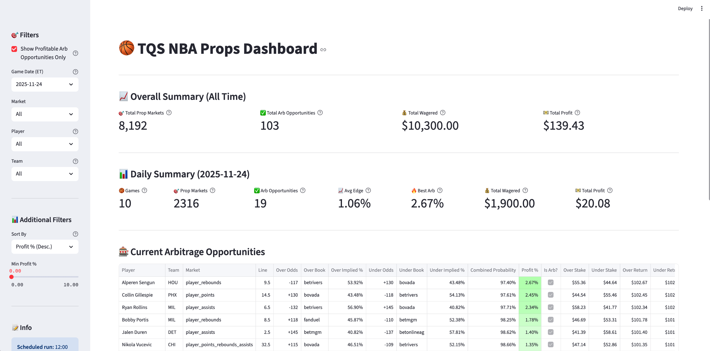

# NBA Arbitrage Dashboard

Local Streamlit dashboard for viewing NBA arbitrage opportunities.

## Quick Start

```bash
# Install dependencies
pip install -r streamlit_app/requirements.txt

# Run the dashboard
streamlit run streamlit_app/app.py
```

The dashboard will open in your browser at `http://localhost:8501`

## Features

- 📊 View today's arbitrage opportunities
- 🔄 Manual "Run Now" button to find new arbs
- 📈 Key metrics (total arbs, avg profit, best opportunity)
- 📅 Historical performance tracking
- 💾 Download opportunities as CSV
- 🎚️ Filter by minimum profit percentage

## Daily Workflow: Backtesting & Finding Plays

### Example: 3PT Under Strategy

This workflow shows how to backtest a strategy on the current season and then check for today's opportunities.

#### Step 1: Get This Season's Game Data

Fetch all player game logs from the NBA API (caches results for 12 hours):

```bash
cd /Users/thomasmyles/dev/betting && python scripts/build_season_game_logs.py

# Or explicitly specify season
python scripts/build_season_game_logs.py --season 2025-26
```

**Output:** Individual player files in `data/01_input/nba_api/season_game_logs/2025_26/`

#### Step 2: Get Props Data (Historical + Today)

Build the NBA calendar and fetch all props from the season up until today:

```bash
# Build calendar for the season
python scripts/nba_calendar_builder.py --season 2025-26

# Fetch player_threes props for entire season
python scripts/fetch_and_build_season_props.py --season 2025-26 --market player_threes
```

**Output:**
- `data/03_intermediate/combined_props_2025_26_player_threes.csv` (all props)
- `data/03_intermediate/consensus_props_2025_26_player_threes.csv` (consensus lines)

#### Step 3: Find Today's Opportunities

Run the strategy finder to identify profitable plays for today:

```bash
# Find 3PT under opportunities using historical performance
python implementation/find_3pt_underdog_unders_today.py

# Sanity check a specific player
python implementation/find_3pt_underdog_unders_today.py --sanity-check "Jose Alvarado" --line 0.5
```

**Output:** `data/04_output/todays_plays/3pt_underdog_unders_YYYYMMDD.csv`

**Note:** Today's live props come from `data/04_output/arbs/raw_....csv` (fetched by Lambda/cron)

## Future Deployment: AWS EC2 (Option A)

**Architecture:**
```
EC2 instance (t2.small, ~$15/month)
├── Cron job → runs arb finder at Noon ET daily
├── Streamlit app → always running on port 8501
└── Data → stored locally at /data/04_output/arbs/
```

**Deployment steps are documented in `app.py` docstring.**

## Screenshots



## Development

The dashboard reads from `data/04_output/arbs/` directory. Make sure you have arb data files:
```
data/04_output/arbs/
├── arb_threes_20251121.csv
├── arb_points_20251121.csv
└── ...
```

Run the arb finder to generate data:
```bash
python scripts/find_arb_opportunities.py --markets player_threes
```

## Troubleshooting

### Player Team Cache Issues

If you see missing teams or players (should have 525 players across 30 teams):

**Quick Fix: Rebuild the cache**
```bash
# Step 1: Fetch latest rosters from NBA API
python scripts/build_full_roster_cache.py

# Step 2: Update player_team_cache.csv
python3 << 'EOF'
import pandas as pd
from datetime import datetime
full_roster = pd.read_csv('data/02_cache/nba_full_roster_cache.csv')
player_team_cache = pd.DataFrame({
    'player_normalized': full_roster['player_normalized'],
    'team': full_roster['team'],
    'timestamp': datetime.now().isoformat()
})
player_team_cache = player_team_cache.drop_duplicates(subset=['player_normalized'], keep='first')
player_team_cache = player_team_cache.sort_values('player_normalized')
player_team_cache.to_csv('data/02_cache/player_team_cache.csv', index=False)
print(f"✅ Updated player_team_cache.csv with {len(player_team_cache)} players")
EOF
```

**When to rebuild:**
- Missing teams (should have all 30 NBA teams)
- After major trades
- At the start of a new season
- If players are showing up as "Unknown Team"

**Alternative:** Click the "Invalidate Cache" button in the dashboard sidebar to rebuild from the web interface.

